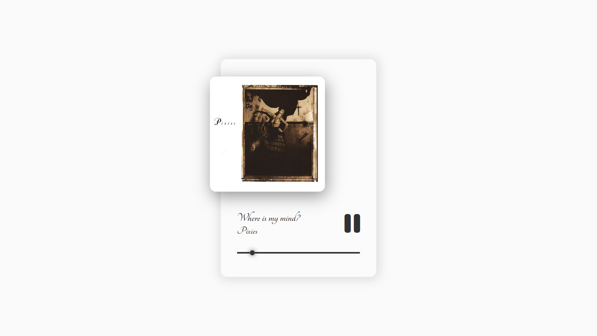

<<<<<<< HEAD
# Music Player Project

This project implements a simple web-based music player using HTML, CSS, and JavaScript that plays the song Where Is My Mind ?

## Preview

## Project Structure

The project consists of the following files and directories:

- `index.html`: Main HTML file containing the structure of the music player interface.
- `style.css`: CSS file for styling the music player interface.
- `mediaQueries.css`: CSS file for responsive design using media queries.
- `script.js`: JavaScript file for controlling the music player functionality.

## Features

- Displays album cover, song title, and artist.
- Provides play/pause functionality on clicking the play button or pressing the spacebar.
- Allows seeking through the song using a progress bar.

## How to Use

1. Clone the repository: `git clone <repository-url>`
2. Open `index.html` in a web browser.
3. Click on the play button or use the spacebar to start/stop the music.
4. Use the progress bar to seek through the song.

## Credits

- Icons from [Font Awesome](https://fontawesome.com/).
- Fonts from [Google Fonts](https://fonts.google.com/).

**link** : https://1sma31l.github.io/Music-player/
=======

>>>>>>> refs/remotes/origin/main
